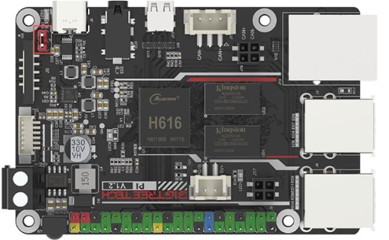

Hello !

This tutorial explains how to flash your different cards so that they work together.

I used the Formbot kit I received in May 2025. The cards are :
  - SKR Pico V1
  - BTT Pi V1.2
  - Voron Display V0

I'm only going to talk about USB communication, as it's the simplest method and UART communication offers few advantages in my opinion.(an update on UART communication is coming)

What's more, the umbilical cable supplied with the kit is very stiff and ended up breaking.

I therefore opted for CAN BUS communication ([as per Mepherotus' excellent guide](https://github.com/rootiest/zippy_guides/blob/main/guides/pico_can.md)
), as the SKR Pico doesn't need a CAN USB adapter. So it's possible to do CANBUS for only $30-35.

Please note that we will first run the USB communication, which enables us to run the printer and all its components. Once everything's working, you can leave it as is or, like me, switch to CAN BUS.

## BTT Pi setup (V1.2)

### Preparation

Install a SSH software (I use MobaXterm) and an image writer software (I use Balena Etcher)

The BTT Pi is BigTreeTech's copy of the Raspberry Pi, optimized for 3D printing. The biggest difference is that it runs on a distribution derived from Armbian, so some commands are specific to that.

We're going to flash the controller via USB. You'll need to install a jumper on the pins in red (for 5V power supply).

Remember to disconnect it when you supply the controller with 24V if you don't want to set your house on fire.

### OS flashing

Please download the official [image](https://github.com/bigtreetech/CB1/releases) from BTT's GitHub.

(Choose the latest Klipper file, it will include Klipper, Mainsail, etc... As a general rule, we want the heaviest .img.xz file..)

1) Insert the micro SD card into your computer.

2) Click on Flash From File

3) Select the target device, in our case the micro SD card.

4) Click on Flash and wait until it's done.

### WiFi setting

Once it's done, you'll see that many files have appeared on our SD card. To configure wifi, open system.cfg

Replace Your Wifi with your WiFi name and Your Password with your WiFi password. Keep the " ".

## SKR Pico setup (V1.0)

1) Insert the micro SD card in your BTT Pi. Wait 1-2 mins.

2) Find the BTT Pi's IP adress. I use my router's user interface

3) Enter this IP adress in your SSH software.

4) Login as biqu

login : `biqu`

password : `biqu`

